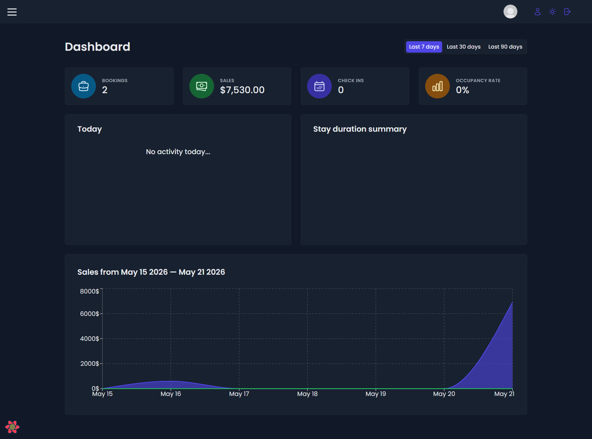

# the-wild-oasis

## Tech Stack

React, Vite, Supabase, React Query, React Hook Form, Styled Components

## About The Project

This project was built using Supabase for backend and data management, Styled Components for creating a modern UI, React Hook Form for form handling and validation, and React Query for efficient API state management. The application was developed with Vite to provide a faster and smoother development experience.
